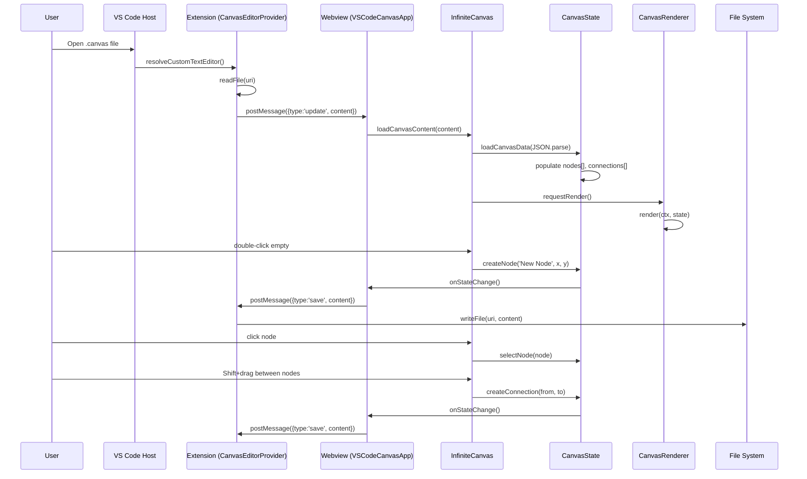

# 1.1 — Архитектура Infinite Canvas (luisfernando.infinite-canvas-0.1.5)

> **Статус:** read-only исследование  
> **Источник:** `luisfernando.infinite-canvas-0.1.5/`  
> **Цель:** понять архитектуру для портирования canvas-core в Electron LEFT pane

---

## 1. Общая архитектура

Расширение VS Code, реализующее **Custom Editor** для `.canvas` файлов (Obsidian-совместимый формат).

```
┌─────────────────────────────────────────────────────────┐
│                   VS Code Extension Host                 │
│  src/extension.ts                                       │
│  ├─ CanvasEditorProvider (CustomTextEditorProvider)      │
│  │   ├─ resolveCustomTextEditor() → webview panel       │
│  │   ├─ loadFile() / saveFile()                         │
│  │   └─ postMessage ↔ webview                           │
│  └─ Commands: infinite-canvas.newCanvas                  │
├─────────────────────────────────────────────────────────┤
│                       Webview                            │
│  webview/main.js          — VSCodeCanvasApp (bridge)     │
│  webview/style.css        — VS Code themed styles        │
│  webview/src/                                             │
│  ├─ InfiniteCanvasSimple.js — ЯДРО: Canvas + State +     │
│  │                            Input + Renderer + UI      │
│  ├─ AIManager.js           — AI-генерация контента       │
│  ├─ aiService.js           — OpenRouter API клиент       │
│  ├─ markdownRenderer.js    — Canvas2D markdown рендер    │
│  └─ markdownParser.js      — Парсер markdown в токены    │
└─────────────────────────────────────────────────────────┘
```

---

## 2. Activation & Entry Points

### Extension Host (VS Code)
- **activationEvents:** `onCustomEditor:infinite-canvas.canvasEditor`, `onLanguage:canvas`
- **main:** `./out/extension.js`
- **Custom Editor:** `CanvasEditorProvider` реализует `CustomTextEditorProvider`
- При открытии `.canvas` файла VS Code вызывает `resolveCustomTextEditor()`, который создаёт webview panel

### Webview Entry
- **`webview/main.js`** — класс `VSCodeCanvasApp`
  - Дожидается DOMContentLoaded
  - Создаёт `new InfiniteCanvas('canvas')`
  - Настраивает `window.vsCodeAPI` postMessage bridge
  - Реализует auto-save с debounce (500ms) и отслеживанием user interaction

---

## 3. Message Protocol: Extension ↔ Webview

> **Важно:** протокол выверен по `out/extension.js` (15 KB, читаемый).
> Имена ниже — реальные строки из кода, не из документации.

### Extension → Webview
| Message Type | Payload | Описание |
|-------------|---------|----------|
| `loadContent` | `{ content: string }` | Загрузка содержимого .canvas файла |
| `fileContentLoaded` | `{ nodeId, content, lastModified }` | Содержимое загруженного файла |
| `fileContentSaved` | `{ nodeId }` | Подтверждение сохранения файла |
| `fileContentError` | `{ nodeId, error }` | Ошибка загрузки/сохранения файла |
| `filePathUpdated` | `{ nodeId, oldPath, newPath }` | Обновление пути файла |
| `groqApiKey` | `{ apiKey: string }` | API ключ OpenRouter (через Groq) |
| `ready` | `{}` | Webview готов к приёму сообщений |

### Webview → Extension
| Message Type | Payload | Описание |
|-------------|---------|----------|
| `save` | `{ content: string }` | Сохранение canvas (JSON) |
| `loadFile` | `{ nodeId, filePath }` | Запрос содержимого файла |
| `saveFile` | `{ filePath, content, nodeId }` | Сохранение изменённого файла |
| `getGroqApiKey` | `{}` | Запрос API ключа |
| `createFile` | `{ path }` | Создание нового файла из webview |

---

## 4. Ядро Canvas: классы и их ответственность

### `InfiniteCanvas` (главный контроллер)
- Инициализирует все подсистемы
- Управляет render loop (on-demand через `requestAnimationFrame`)
- Координирует `canvasState`, `inputHandler`, `renderer`, `aiManager`, `uiManager`
- Методы: `setupCanvas()`, `initializeComponents()`, `render()`, `resizeCanvas()`

- **Размер ядра:** ~4 462 LOC (только `InfiniteCanvasSimple.js`) + ~1 416 LOC (остальные `webview/src/*.js`) = **~5 878 LOC** всего webview/src
- **Не «~1000 строк»** — порт LEFT требует серьёзных трудозатрат (CanvasState/InputHandler/CanvasRenderer — все тяжёлые)

### `CanvasState` (состояние)
```js
{
  nodes: [],           // массив узлов
  connections: [],     // массив рёбер (from, to, fromSide, toSide)
  selectedNodes: [],   // выбранные узлы
  selectedConnection: null,
  offsetX, offsetY,    // pan offset
  scale: 1,            // zoom
  nodeCounter: 0       // автоинкремент ID
}
```
- Методы: `createNode()`, `deleteNode()`, `createConnection()`, `deleteConnection()`
- `selectNode()`, `toggleSelection()`, `addToSelection()`, `clearSelection()`
- `exportCanvasData()` → Obsidian JSON формат
- `loadCanvasData(data)` → импорт Obsidian JSON
- `onStateChange` callback для автосохранения
- `onSelectionChange` callback для обновления UI

### `InputHandler` (ввод)
- Обработчики: `mousedown`, `mousemove`, `mouseup`, `wheel`, `dblclick`, `keydown`
- Состояния: `isDragging`, `isNodeDragging`, `isPanning`, `isSelecting`, `isConnecting`, `isResizing`
- Multi-select: Ctrl/Cmd+click (toggle), Shift+click (add)
- Pan: middle mouse button или Alt + drag
- Zoom: колесо мыши (scale multiplier 1.1)
- Connection: Shift+drag от connection point узла
- Resize: drag за handles (8 точек: углы + середины сторон)
- Selection rectangle: drag по пустому пространству

### `CanvasRenderer` (отрисовка)
- Canvas2D рендеринг
- Отрисовка фона (сетка/точки)
- Отрисовка узлов (прямоугольники с текстом, скроллбар, resize handles)
- Отрисовка рёбер (линии от fromSide к toSide)
- Отрисовка selection rectangle
- Отрисовка connection preview (при создании связи)
- Поддержка markdown в тексте узлов (через `MarkdownRenderer`)

### `UIManager` (UI элементы)
- Floating action button (AI generate)
- Notification system
- Modal диалоги (просмотр содержимого файла)
- Контекстное меню
- Панель AI моделей

---

## 5. AI Integration

### `AIManager`
- Привязка к `canvasState` и `uiManager`
- `generateAI()` — генерация идей от выбранного узла
- Поддержка файловых узлов (загрузка содержимого .md)
- Connected nodes → conversation history для LLM
- Использует модели из localStorage (ui панель)

### `aiService.js`
- `generateAIIdeasGroq(selectedNodeText, connectedNodes, model, fileContent)`
- OpenRouter API: `https://openrouter.ai/api/v1/chat/completions`
- Модели: `anthropic/claude-3.5-sonnet` (default), Google Gemini, OpenAI GPT-4, etc.
- API key из настроек VS Code или localStorage

---

## 6. Canvas Format (.canvas)

Obsidian-совместимый JSON:
```json
{
  "nodes": [
    {
      "id": "string",
      "type": "text" | "file",
      "x": number, "y": number,
      "width": number, "height": number,
      "text": "string",          // для type=text
      "file": "path/to/file.md"  // для type=file
    }
  ],
  "edges": [
    {
      "id": "string",
      "fromNode": "node-id",
      "toNode": "node-id",
      "fromSide": "top"|"bottom"|"left"|"right",
      "toSide": "top"|"bottom"|"left"|"right"
    }
  ]
}
```

---

## 7. Data Flow диаграмма



---

## 8. Port Targets для Electron LEFT Pane

> **Объём порта:** ~5 878 LOC JS → TS (CanvasState + InputHandler + CanvasRenderer + UIManager).
> Это **не «тонкий» порт** — ядро, ввод и рендер тяжёлые.

### Что портировать как есть:
| Компонент | Приоритет | Заметки |
|-----------|-----------|---------|
| `CanvasState` | **HIGH** | Ядро состояния: nodes, edges, selection, viewport. Минимальные изменения. |
| `CanvasRenderer` (Canvas2D) | **HIGH** | Рендеринг на canvas. Портировать с заменой VS Code theme vars на CSS custom properties. |
| `InputHandler` | **HIGH** | Все взаимодействия: pan, zoom, select, connect, resize. |
| `.canvas` формат (export/import) | **HIGH** | Obsidian-совместимый JSON. Портировать без изменений. |

### Что требует значительной адаптации:
| Компонент | Приоритет | Заметки |
|-----------|-----------|---------|
| `VSCodeCanvasApp` (bridge) | **HIGH** | Заменить VS Code postMessage на Electron IPC |
| `AIManager` + `aiService` | **MEDIUM** | API вызовы остаются теми же, но конфигурация через Electron settings |
| `UIManager` | **MEDIUM** | Заменить VS Code theme vars, модальные окна |
| `MarkdownRenderer` | **LOW** | Canvas2D рендеринг рабочий, но в Electron можно Monaco |

### Что НЕ портировать:
- VS Code extension activation/lifecycle
- CustomTextEditorProvider
- VS Code configuration contributes
- VS Code theme variables (заменить на CSS custom properties)

---

## 9. Выводы

1. **Canvas core компактный** — ~1000 строк JavaScript без зависимостей от npm
2. **Canvas2D рендеринг** — не xyflow/react-flow; потребует адаптации для интеграции с React (если выбран React для Electron)
3. **AI модуль изолирован** — легко заменить/мокать
4. **Формат .canvas** зрелый и стабильный
5. **Основная работа при портировании:** замена VS Code API bridge на Electron IPC + адаптация стилей
